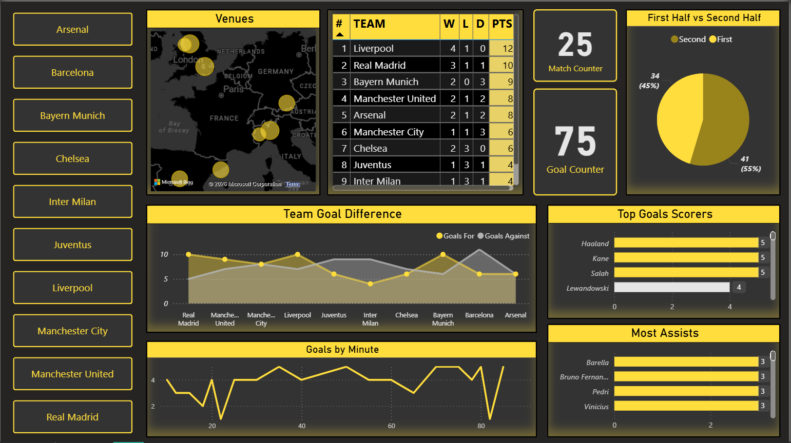

# ⚽ Football League Analytics (SQL + Power BI)
End-to-end football analytics project using SQL for data modeling & analysis and Power BI for visualization.

## 📌 Overview

Built a complete football analytics system using MySQL and Power BI to analyze team performance, player statistics, and match-level data.

This project covers the full pipeline:
**Data Modeling → Data Analysis → Data Visualization**

---

## 🛠️ Tech Stack

* MySQL (Data Modeling & Analysis)
* Power BI (Dashboard & Visualization)

---

## 📊 Features

* League Standings (Points, Wins, Draws, Losses, Goal Difference)
* Top Goal Scorers
* Most Assists
* Goals + Assists (GA)
* Own Goals Tracking
* Match & Goal Statistics

---

## 🧠 How Analysis is Done

- League standings are calculated using SQL window functions based on points (3 for win, 1 for draw), goal difference, and goals scored  
- Top scorers are derived by counting goals for each player while excluding own goals  
- Assists are calculated from goal data where assist information is available  
- Goals + Assists (GA) combines both metrics to measure overall player contribution  
- Own goals are tracked separately to capture defensive errors and their impact on match outcomes  
- SQL triggers are used to enforce real-world constraints such as preventing self-assists and disallowing assists on penalties  

---

## 📁 SQL Files

* `Table Creation.sql` → Database schema (teams, players, matches, goals)
* `Data_insertion.sql` → Sample data for all tables
* `Stats Creation.sql` → Analytical views (standings, goals, assists, GA)
* `Triggers Creation.sql` → Data integrity rules (no self-assist, no penalty assist)
* `Alters.sql` → Table modifications

---

## 📷 Dashboard Preview

### 🏟️ Teams

### 🧍 Players Data

### 🟦 League Standings

### ⚽ Matches Data

### 🎯 Goals Data

### 🏆 Top Scorers

### 🎯 Most Assists

### 🔥 Goals + Assists

### ⚠️ Own Goals

---

## 📊 Power BI Dashboard

---

## 🧠 Key Insights

* Liverpool dominated the league with the highest points and consistent performance
* Barcelona showed defensive weaknesses with higher goals conceded
* Haaland, Kane, and Salah emerged as top goal scorers
* Midfielders contributed significantly to assists and overall playmaking
* Own goals influenced match outcomes in multiple scenarios

---

## 🚀 Outcome

This project demonstrates:

* Relational database design using SQL
* Analytical querying using views and aggregations
* Data validation using triggers
* Data visualization using Power BI

---

## 📌 Conclusion

An end-to-end data analytics project showcasing:
**Data Modeling → Data Analysis → Data Visualization**

---

## ⚠️ Note on Data

The data used in this project is **synthetically generated for analytical purposes** and does not represent actual football matches or real-world statistics.

Match results, player performances, and events (goals, assists, own goals) are designed to simulate realistic scenarios for demonstrating data modeling, analysis, and visualization techniques.
