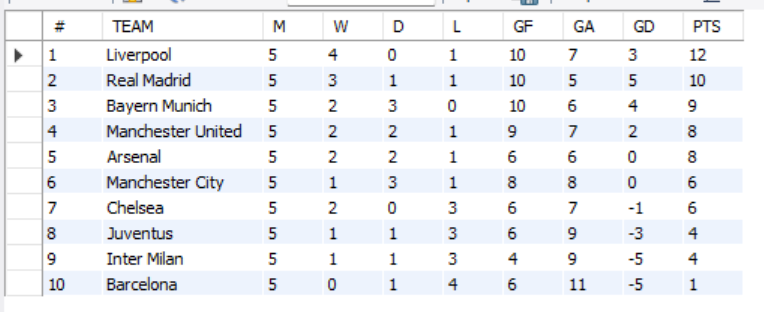
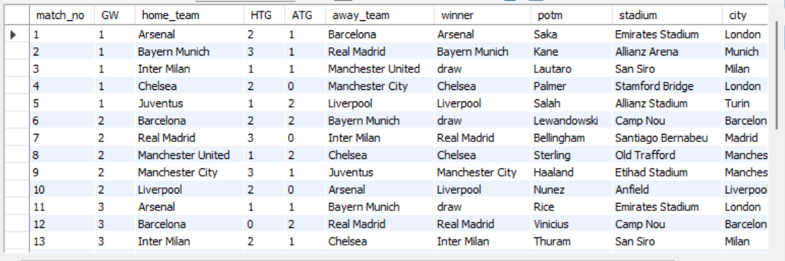
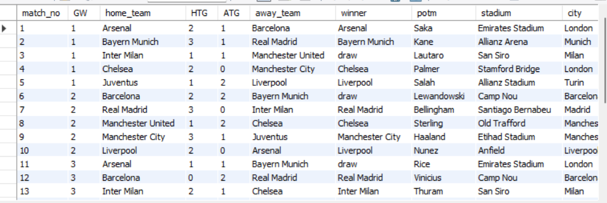
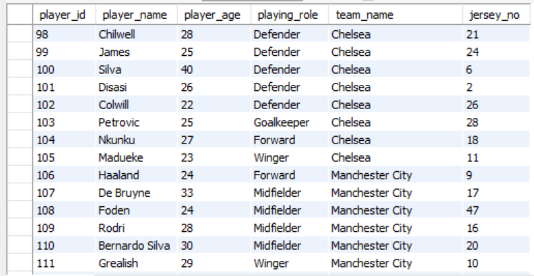
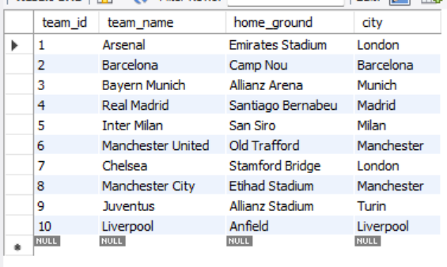
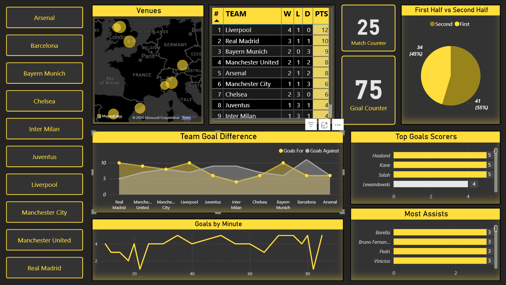

# football_league_analytics

# ⚽ Football League Analytics (SQL + Power BI)

## 📌 Overview

This project focuses on building a football league analytics system using MySQL and visualizing insights through a Power BI dashboard.

It analyzes team performance, player statistics, and match-level data with realistic scenarios including assists, penalties, and own goals.

---

## 🛠️ Tech Stack

* MySQL (Database & SQL Queries)
* Power BI (Dashboard & Visualization)

---

## 📊 Features

* League Standings (Points, Wins, Losses, GD)
* Top Goal Scorers
* Most Assists
* Goals + Assists (GA)
* Own Goals Tracking
* Match & Goal Analysis

---

## 📁 SQL Files

* `Table Creation.sql` → Database schema (teams, players, matches, goals)
* `Data_insertion.sql` → Sample data for all tables
* `Stats Creation.sql` → Analytical views (standings, goals, assists, GA)
* `Triggers Creation.sql` → Data integrity rules (no self-assist, no penalty assist)
* `Alters.sql` → Table modifications

---

## 📷 Dashboard Preview

### 🟦 League Standings

### ⚽ Matches Data

### 🎯 Goals Data

### 🧍 Players Data

### 🏆 Top Scorers

### 🎯 Most Assists

### 🔥 Goals + Assists

### ⚠️ Own Goals

### 🏟️ Teams

---

## 📊 Power BI Dashboard

---

## 🧠 Key Insights

* Liverpool emerged as the top-performing team in the league
* Barcelona showed weaker defensive performance with higher goals conceded
* Haaland, Kane, and Salah dominated the scoring charts
* Midfielders contributed significantly to assists
* Own goals impacted match outcomes in multiple scenarios

---

## 🚀 Outcome

This project demonstrates:

* Relational database design using SQL
* Analytical querying using views
* Data validation using triggers
* Data visualization using Power BI

---

## 📌 Conclusion

An end-to-end data analytics project covering:
**Data Modeling → Data Analysis → Data Visualization**
